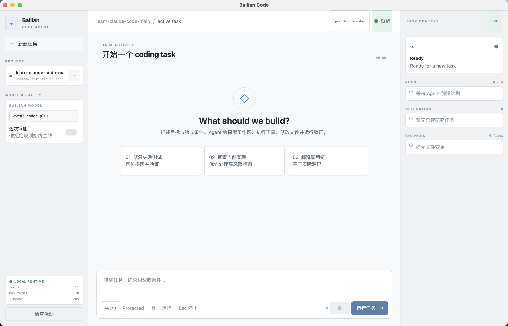

# Bailian Coding Agent

一个使用阿里云百炼 OpenAI 兼容接口的本地 Coding Agent。它可以读取和搜索工作区、精确修改文件、运行命令与测试，并通过原生 PySide6/Qt 窗口展示计划、工具调用、Subagent、验证结果和真实变更文件。



> 截图来自 macOS 上实际启动的 Qt 应用窗口，不是网页、设计稿或静态原型。

## 能做什么

- 在所选工作区内读取、搜索、创建和精确编辑文本文件；
- 执行 shell 命令，并把测试、构建或 Lint 作为独立验证记录；
- 使用 Todo 展示多步骤计划，使用只读 Subagent 完成跨文件研究；
- 对 shell、验证命令和显式文件覆盖执行宿主审批；
- 修改文件后若没有成功验证，Stop Gate 会拒绝直接宣称完成；
- 保存可选择召回的项目记忆，并对长上下文进行分层压缩。

## 快速开始

项目要求 Python 3.10+。以下示例使用 Conda：

```bash
git clone git@github.com:peb44043399-web/bailian-coding-agent.git
cd bailian-coding-agent

conda create -n bailian-code python=3.12 -y
conda run -n bailian-code python -m pip install -r requirements.txt
```

配置百炼 API Key。不要把真实 Key 写入 Git：

```bash
export DASHSCOPE_API_KEY="你的百炼 API Key"
```

启动原生桌面 GUI：

```bash
conda run -n bailian-code python -m simple_coding_agent
```

在窗口中选择代码工作区，确认模型 ID，输入任务后点击“运行任务”。普通 shell/测试命令会逐条请求批准；只有在可信的一次性工作区中才建议开启“自动批准”。

常用快捷键：

- `Command+Enter`：运行任务；Windows/Linux 使用 `Ctrl+Enter`；
- `Command+K`：新建任务；
- `Esc`：请求停止，将在当前 API 调用或命令结束后生效。

## 命令行模式

一次性任务：

```bash
conda run -n bailian-code python -m simple_coding_agent \
  --workspace /absolute/path/to/project \
  "检查失败测试，修复根因并运行相关验证"
```

连续终端对话：

```bash
conda run -n bailian-code python -m simple_coding_agent \
  --cli --workspace /absolute/path/to/project
```

## 安全边界

- 文件工具不能越过所选工作区；
- 已存在文件默认不能被完整覆盖，显式覆盖仍需审批；
- `rm -rf /`、`sudo`、`git reset --hard` 等模式会被硬拒绝；
- 自动批准不会绕过硬拒绝规则；
- 这不是操作系统沙箱，shell 仍拥有当前用户权限。

## 测试

以下测试不调用真实模型 API：

```bash
conda run -n bailian-code python -m unittest -v \
  simple_coding_agent.test_agent \
  simple_coding_agent.test_qt_gui \
  simple_coding_agent.test_runtime_features \
  examples.knapsack.test_knapsack_problem
```

## 来源与范围

Harness 机制来自 [shareAI-lab/learn-claude-code](https://github.com/shareAI-lab/learn-claude-code) 的 s01–s17，包括 Agent Loop、Tool Use、Permission、Hooks、Todo、Subagent、Skill Loading、Context Compact、Memory 和 Stop Gate。本仓库只打包当前 Agent 运行与测试所需代码，不复制整套教学站点。

更详细的机制、复用点和能力边界见 [中文说明](simple_coding_agent/README.zh.md) 与 [s01–s17 复用表](simple_coding_agent/REUSE_MAP.zh.md)。
